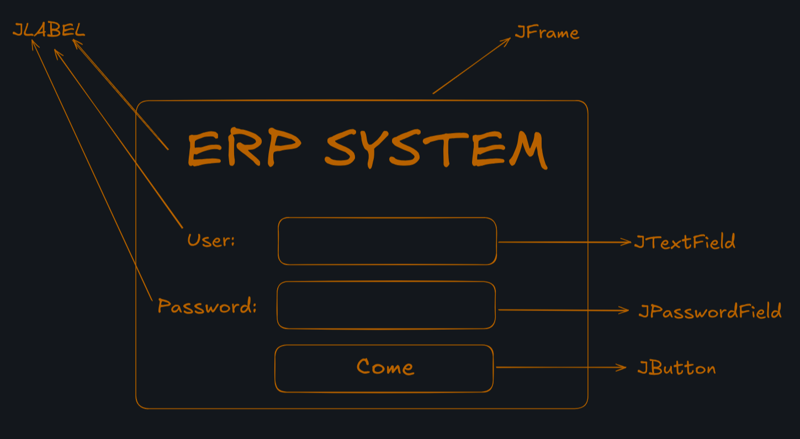

```txt
                                ███████╗   ██████╗    ██████╗                           
                                ██╔════╝   ██╔══██╗   ██╔══██╗                          
                                █████╗     ██████╔╝   ██████╔╝                          
                                ██╔══╝     ██╔══██╗   ██╔═══╝                           
                                ███████╗██╗██║  ██║██╗██║                               
                                ╚══════╝╚═╝╚═╝  ╚═╝╚═╝╚═╝                               
                                                                                        
██╗    ██╗██╗███╗   ██╗███████╗    ███████╗██╗   ██╗███████╗████████╗███████╗███╗   ███╗
██║    ██║██║████╗  ██║██╔════╝    ██╔════╝╚██╗ ██╔╝██╔════╝╚══██╔══╝██╔════╝████╗ ████║
██║ █╗ ██║██║██╔██╗ ██║█████╗      ███████╗ ╚████╔╝ ███████╗   ██║   █████╗  ██╔████╔██║
██║███╗██║██║██║╚██╗██║██╔══╝      ╚════██║  ╚██╔╝  ╚════██║   ██║   ██╔══╝  ██║╚██╔╝██║
╚███╔███╔╝██║██║ ╚████║███████╗    ███████║   ██║   ███████║   ██║   ███████╗██║ ╚═╝ ██║
 ╚══╝╚══╝ ╚═╝╚═╝  ╚═══╝╚══════╝    ╚══════╝   ╚═╝   ╚══════╝   ╚═╝   ╚══════╝╚═╝     ╚═╝                                                                                  
```

>[!NOTE]
> Stopped Video in: 1h:19min
> [video](/media/faleite/External/VideoAulas/curso-completo-java-matheus/aula02.mkv)

## Resources
- [jdbc.postgres](https://jdbc.postgresql.org/download/)

# Java Desktop
## Screen Types
### JFrame
- Janela totalmente livre.
### JDialog
- Caracteristica Modal. 
- Este tipo de tela sempre ficara em foco, não possibilitando usar outra tela.
### JInternalFrame
- Ao criar este tipo de Tela ela cria em cima do menu principal e ficara somente neste espaço
- Frequentemente Utilizada para menus de software. 
- Vem com propriedades para subtelas
## Screen Login
[](dcs/images/screen-login.png)